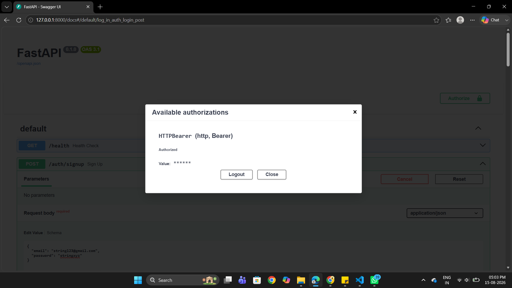

# Supabase & FastAPI Authentication Project

A secure, multi-stage authentication and user management API built with Python, FastAPI, and Supabase for backend security.

---

## Project Evolution & Stages

This repository demonstrates incremental backend development from basic endpoints and user simulation to secure token verification, middleware protection, and production-ready documentation:

* **Stage 1 (Authentication Routes):** Implemented core sign-up (`POST /auth/signup`) and log-in (`POST /auth/login`) endpoints utilizing Supabase Auth integration with Pydantic validation.
* **Stage 2 (Public & Protected Gates):** Created public informational routes (`GET /public/info`) and unverified protected endpoints (`GET /protected/profile`) to handle authorization headers.
* **Stage 3 (Token Verification):** Upgraded protected routes to securely pass and verify JWT access tokens via `supabase.auth.get_user(token)`, handling expired or tampered tokens with `401 Unauthorized` responses.
* **Stage 4 (Middleware & Logout):** Extracted authentication logic into a reusable FastAPI dependency (`get_current_user`) acting as a middleware guard, and added a secure session termination endpoint (`POST /auth/logout`).
* **Stage 5 (Swagger UI with Bearer Auth):** Integrated FastAPI's `HTTPBearer` security scheme to enable the interactive **Authorize** padlock button directly within the Swagger UI.
* **Stage 6 (Deployment & Documentation):** Finalized repository structure, environment configuration, and comprehensive API documentation.

---

## Tech Stack
* **Framework:** FastAPI (Python)
* **Server:** Uvicorn
* **Authentication & Database:** Supabase Auth
* **Environment Management:** `python-dotenv`
* **Validation:** Pydantic

---

## Getting Started

### 1. Clone the Repository
```bash
git clone [https://github.com/Aarya-505/todo-api.git](https://github.com/Aarya-505/todo-api.git)
cd todo-api

```

### 2. Set Up Virtual Environment
```bash
python -m venv venv
# On Windows (PowerShell):
.\venv\Scripts\Activate.ps1
```

### 3. Install Dependencies
```bash
pip install fastapi uvicorn supabase python-dotenv pydantic
```

### 4. Configure Environment Variables
```bash
Create a .env file in the root directory and add your Supabase credentials:

SUPABASE_URL=your_supabase_project_url
SUPABASE_KEY=your_supabase_anon_key
```
### 5. Run the Application
```bash
uvicorn main:app --reload
Access the interactive API documentation at: http://127.0.0.1:8000/docs
```

### Swagger UI & Bearer Authentication
```bash
Once the server is running, navigate to http://127.0.0.1:8000/docs. You will see the green Authorize button at the top right.

Step 1: Log in via POST /auth/login to obtain your access_token.
Step 2: Click Authorize, paste your token, and test protected routes like /protected/profile and /auth/logout interactively.




```
## API Endpoints

| Method | Endpoint | Description | Access |
| :--- | :--- | :--- | :--- |
| `GET` | `/health` | Server health check and Supabase connectivity | Public |
| `POST` | `/auth/signup` | Register a new user account | Public |
| `POST` | `/auth/login` | Authenticate user and return JWT access tokens | Public |
| `GET` | `/public/info` | Public informational endpoint | Public |
| `GET` | `/protected/profile` | Retrieve verified user profile details | Protected (Bearer Token) |
| `POST` | `/auth/logout` | Terminate the user session with Supabase | Protected (Bearer Token) |
